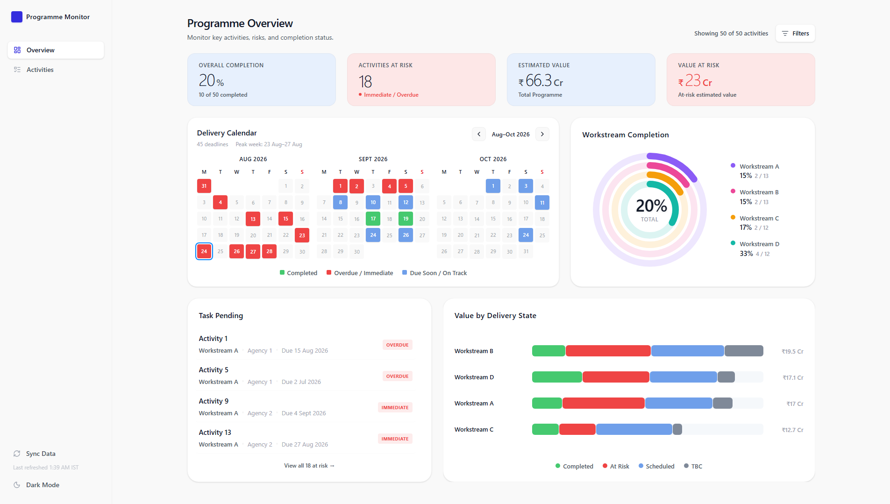

# Programme Monitor


Programme Monitor is a lightweight operational analytics dashboard for tracking programme delivery, deadlines, risks, completion, and estimated value.

It uses Google Sheets as an accessible source of truth, with FastAPI handling validation and normalization before the data is visualized through a React dashboard.

## Preview



For a detailed product walkthrough, see [`WalkThrough.md`](WalkThrough.md).

## Features

- **Programme overview dashboard** with completion, risk, value, and delivery metrics
- **Dashboard filtering** by Workstream, Sub-Workstream, and Agency
- **Activity explorer** with search, filtering, and multi-dimensional sorting
- **Activity detail drawer** for individual programme items
- **Timeline health states** including Overdue, Immediate, Due Soon, On Track, and TBC
- **Google Sheets integration** for live programme data
- **Manual data sync** with server-side caching
- **Responsive light and dark interfaces**

## Tech Stack

**Frontend**
- React 19
- TypeScript
- Vite
- Tailwind CSS v4
- Lucide React

**Backend & Infrastructure**
- FastAPI
- Python 3.14
- Google Sheets API
- Azure Static Web Apps
- Azure App Service
- GitHub Actions

## Architecture

```text
Google Sheets
    ↓
FastAPI / Azure App Service
    ↓
React / Azure Static Web Apps
```

## Local Development

### Frontend

```bash
cd frontend
npm install
npm run dev
```

### Backend

```bash
cd backend
python -m venv venv
```

Activate the environment:

```bash
source venv/bin/activate
```

Windows:

```powershell
venv\Scripts\activate
```

Then run:

```bash
pip install -r requirements.txt
uvicorn app.main:app --reload
```

Environment examples are provided in:

```text
frontend/.env.example
backend/.env.example
```

## Documentation

See [`WalkThrough.md`](WalkThrough.md) for a deeper look at the interface, user flows, filtering, visualizations, and design decisions.

## Status

**v0.5.13** — core application and live-data pipeline deployed.

## License

Licensed under the [MIT License](LICENSE).