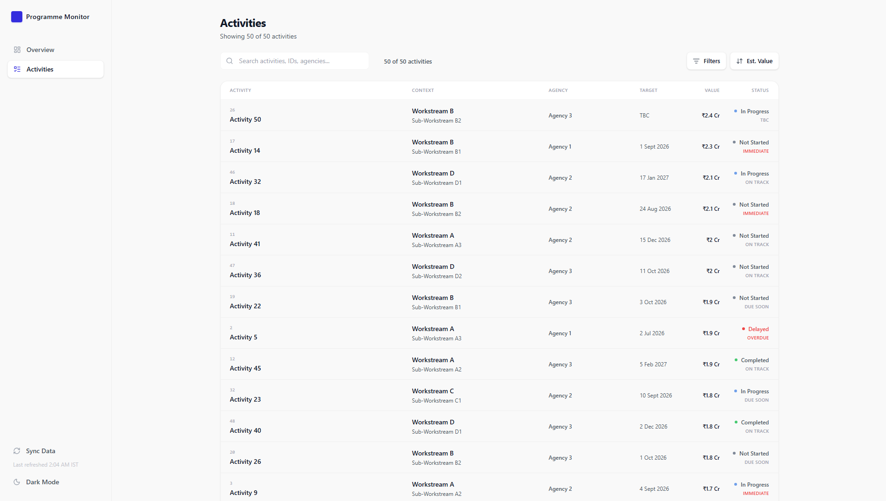
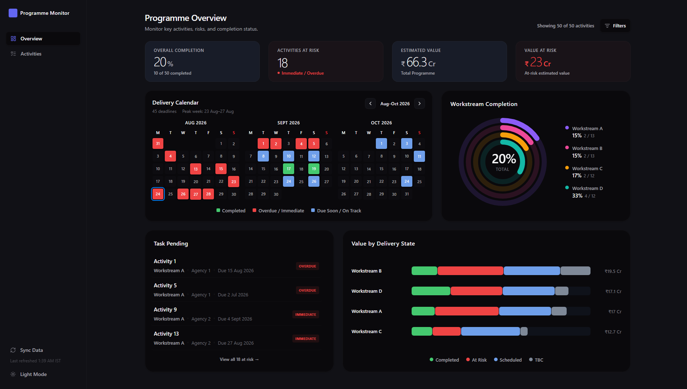

# Programme Monitor Walkthrough

Programme Monitor is a lightweight operational analytics dashboard for monitoring programme delivery, deadlines, risk, completion, and estimated value.

Rather than replacing an existing programme-data workflow, the application adds a structured analytics layer on top of it. Programme data remains maintained in Google Sheets, while Programme Monitor transforms that data into a clearer operational view for monitoring and decision-making.

---

## User Journey

The interface is organized around two levels of analysis:

1. **Programme Overview** - understand overall delivery health, upcoming deadlines, risk, completion, and value concentration.
2. **Activity Explorer** - investigate the individual activities behind those metrics using search, filtering, sorting, and activity details.

This allows users to move from portfolio-level monitoring into individual programme items without turning the dashboard into a data-entry system.

Access to the deployed application is authenticated through Firebase Authentication. Only approved users can retrieve programme data from the backend.

---

## Programme Overview

The **Programme Overview** is the main analytical view of the application.


### Programme Health

Four headline indicators summarize the current programme state:

* **Overall Completion** - percentage and number of completed activities.
* **Activities at Risk** - activities currently classified as Immediate or Overdue, excluding work already completed.
* **Estimated Value** - total estimated value represented by the selected programme scope.
* **Value at Risk** - estimated value associated with activities currently requiring attention.

These metrics respond to the dashboard filters, allowing the same overview to be used for the entire programme or a narrower operational scope.

### Dashboard Scope

The Overview can be filtered by:

* Workstream
* Sub-Workstream
* Agency

Filtering applies across the dashboard rather than to a single visualization. This makes it possible to inspect a particular area of the programme while preserving the same analytical layout.

### Delivery Calendar

The Delivery Calendar provides a time-oriented view of programme activity.

Instead of reading target dates individually from a spreadsheet, users can see how delivery is distributed across the current timeline and identify periods containing immediate or overdue work.

Dates containing multiple activities are represented together rather than being reduced to a single item. The calendar shows the number of activities scheduled for a date, while selecting that date opens the complete list with each activity's delivery status clearly identified.

This makes congested delivery periods easier to understand without losing the activity-level detail behind them.

### Workstream Completion

The workstream view provides a structural breakdown of programme progress.

This makes differences in completion across major areas easier to identify without having to inspect individual activities one at a time.

### Needs Attention

Activities requiring immediate attention are surfaced directly on the Overview.

This creates a direct path from programme-level monitoring to the underlying activity. Selecting an activity opens its detail view, while the Activity Explorer can be opened with the relevant risk scope applied.

### Value Concentration

Programme value is visualized alongside delivery state and workstream distribution.

This adds another dimension to programme monitoring: an activity can be operationally important not only because of its deadline, but also because of the amount of estimated value associated with it.

Estimated values originate from the source data in **INR lakh** and are formatted for clearer presentation in the interface.

---

## Activity Explorer

The **Activity Explorer** provides the detailed view behind the dashboard.



It is designed for locating, comparing, and investigating individual programme activities while preserving the broader monitoring workflow.

### Search

Activities can be searched in real time using information including:

* activity ID
* activity title
* agency
* workstream
* sub-workstream

Search works alongside filtering and sorting rather than replacing them.

### Filtering

The Explorer supports filtering across several dimensions:

* Workstream
* Sub-Workstream
* Agency
* Timeline Status
* Completion Status

Available Sub-Workstreams respond to the selected Workstream scope, reducing irrelevant filter choices.

The filtering interface includes responsive behavior for smaller screens, although the desktop experience remains the most complete and refined.

### Sorting

Activities can be ordered by several operational dimensions, including:

* Serial No.
* Target Date
* Estimated Value
* Urgency
* Activity Name
* Completion Status

Sorting follows a three-state interaction:

`Ascending → Descending → Default`

Only one primary sort mode is selected at a time, making the resulting activity order predictable and easy to reset.

### Activity Details

Selecting an activity opens a side drawer containing key information such as:

* activity identifier
* activity title
* workstream and sub-workstream
* responsible agency
* target date
* estimated value
* timeline status
* completion status

The drawer allows an activity to be inspected without navigating away from the current filtered or sorted view.

---

## Timeline and Completion Logic

Programme Monitor treats **timeline status** and **completion status** as separate concepts.

### Timeline Status

Timeline status is derived from an activity's target date and normalized into:

* `Overdue`
* `Immediate`
* `Due Soon`
* `On Track`
* `TBC`

This provides a consistent operational interpretation even when the source spreadsheet contains different date formats or special values.

### Completion Status

Completion describes the actual delivery state of an activity:

* `Not Started`
* `In Progress`
* `Completed`
* `Delayed`

Keeping these dimensions separate prevents schedule urgency from being confused with delivery progress.

For example, an activity may have an old target date but already be completed. Programme Monitor accounts for this when determining which activities should actually be presented as requiring attention.

---

## Data Flow

Programme Monitor uses a deliberately simple data pipeline:

```text
Google Sheets
      │
      ▼
   FastAPI
Google Cloud Run
      │
      ├── Source validation
      ├── Data normalization
      ├── Timeline derivation
      ├── Server-side caching
      └── Firebase token verification
      │
      ▼
 React Frontend
Firebase Hosting
      │
      ├── Programme Overview
      └── Activity Explorer
```

### Google Sheets as the Source of Truth

Google Sheets is used as the operational data source because it remains accessible to team members who need to maintain programme information without requiring them to use the dashboard as a data-entry application.

This preserves a familiar collaborative workflow while providing a separate interface optimized for analysis and monitoring.

Programme Monitor does not write programme data back to Google Sheets. Data maintenance remains restricted to users with access to the source spreadsheet.

### FastAPI Backend

The backend retrieves programme data through the Google Sheets API and converts spreadsheet rows into a consistent application model.

Its responsibilities include:

* identifying relevant spreadsheet columns
* validating required data
* normalizing completion states
* parsing target dates
* deriving timeline status
* normalizing estimated values
* caching recently retrieved data
* validating Firebase authentication tokens
* enforcing the approved-user access list

This keeps spreadsheet-specific and access-control concerns away from the frontend.

### Authentication and Access Control

Firebase Authentication provides the sign-in layer for the deployed application.

After authentication, the frontend sends the user's Firebase ID token with API requests. The FastAPI backend verifies that token before returning programme data.

Access is further restricted through an approved email allowlist. This means authentication alone does not automatically grant access to the programme dataset.

The production access path is:

```text
User
  │
  ▼
Firebase Authentication
  │
  ▼
React / Firebase Hosting
  │
  │ Firebase ID Token
  ▼
FastAPI / Google Cloud Run
  │
  ▼
Google Sheets
```

The Google Cloud Run service accesses Google Sheets through its assigned Google Cloud service identity rather than requiring service-account credential files to be stored in the deployed application.

### Data Synchronization

Programme data is cached server-side to avoid unnecessary requests to the Google Sheets API.

Users can also manually request a fresh synchronization from the interface. The dashboard displays the timestamp of the most recently retrieved dataset so users can understand how current the displayed information is.

---

## Responsive & UX Design

Programme Monitor currently prioritizes the desktop experience, where the dashboard, activity explorer, filters, and detail views are most complete.



The interface includes responsive layout behavior in several areas, but mobile optimization is still a work in progress and some views may require further refinement on smaller screens.

The application includes user-selectable **light and dark themes**, along with explicit empty states for situations where the source contains no activities or filtering reduces the current scope to zero results.

The activity detail experience also preserves context: users can inspect an item and return to the same filtered or sorted view instead of losing their place.

---

## Architecture

The frontend and backend are deployed independently within the Google Cloud and Firebase ecosystem:

```text
Google Sheets
      │
      ▼
FastAPI API
Google Cloud Run
      ▲
      │
Firebase Authentication
      ▲
      │
React Application
Firebase Hosting
```

The frontend is built with **React 19, TypeScript, Vite, Tailwind CSS v4, and Firebase Authentication**, and is deployed through **Firebase Hosting**.

The backend uses **FastAPI on Python 3.14**, deployed to **Google Cloud Run**, with the **Google Sheets API** as its external data source.

In production, Google Sheets access is handled through the Cloud Run service identity using Google Cloud Application Default Credentials.

The frontend and backend therefore remain independently deployable while sharing Firebase Authentication as the access-control layer between the user and the API.

---

## Scope

Programme Monitor is intentionally focused on **visualization, monitoring, and analysis**.

The dashboard does not create, edit, or delete programme activities. Source-data maintenance remains in Google Sheets and is governed by access to that source.

This separation keeps responsibilities clear:

* **Google Sheets** is where authorized team members maintain programme data.
* **Firebase Authentication** controls access to the deployed application.
* **FastAPI** validates, secures, and prepares programme data.
* **Programme Monitor** provides the analytical and monitoring interface.

The result is a lightweight dashboard that improves visibility over an existing operational workflow without requiring that workflow to be replaced.
